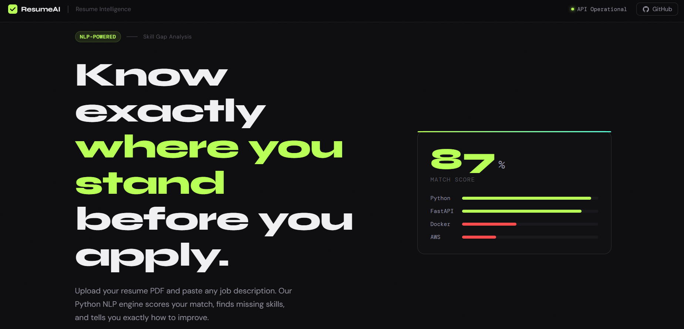
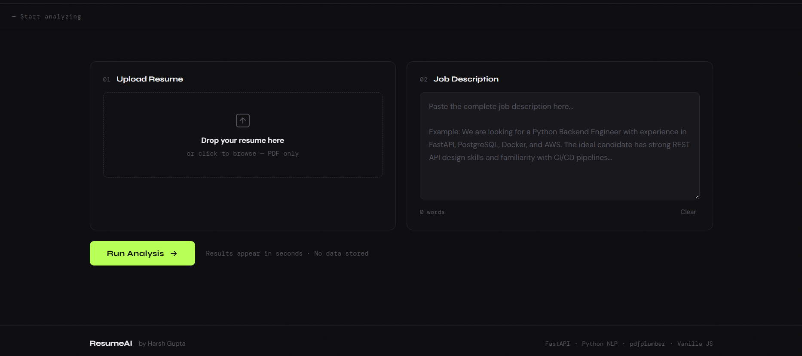
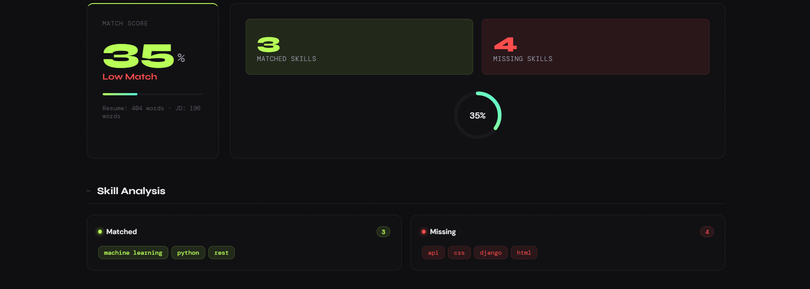
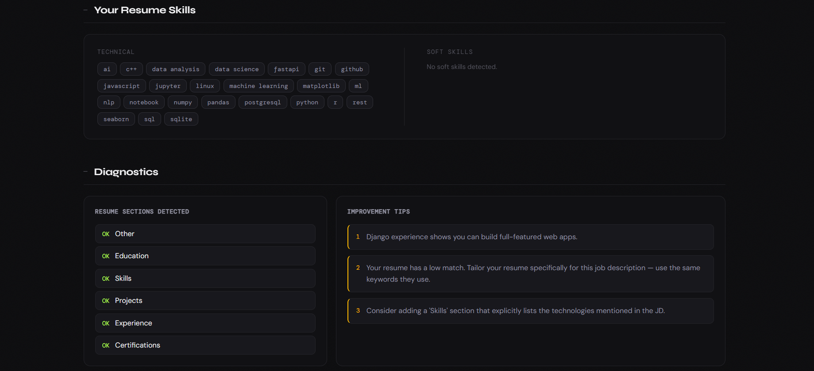

# Smart Resume Analyzer 🚀

> An AI-powered full-stack web app that analyzes a resume PDF against a job description using NLP and keyword matching — built with **FastAPI**, **Python**, **pdfplumber**, **NLTK**, and a pure **HTML/CSS/JS** frontend.

🌐 **Live Demo:** [harshgupta257.github.io/smart-resume-analyzer](https://harshgupta257.github.io/smart-resume-analyzer)

---

## 📸 Screenshots

### Hero — Landing Page


### Analyzer — Upload & Input Form


### Results — Match Score & Skill Breakdown


### Results — Resume Skills & Diagnostics


---

## ✨ Features

- 📄 **PDF Resume Upload** — drag-and-drop or click to upload
- 💼 **Job Description Analysis** — paste any JD text
- 📊 **Match Score** — animated score ring showing 0–100% compatibility
- ✅ **Matched Skills** — skills found in both resume and JD
- ❌ **Missing Skills** — gaps to fill before applying
- 💡 **Improvement Suggestions** — personalized, actionable tips
- 🔍 **200+ Skills Tracked** — Python, AWS, Docker, SQL, React, ML, and more
- 🌐 **Premium Dark UI** — sharp editorial design, fully responsive

---

## 🛠️ Tech Stack

| Layer        | Technology                          |
|-------------|--------------------------------------|
| Backend      | FastAPI (Python)                    |
| PDF Parsing  | pdfplumber                          |
| NLP Engine   | NLTK + custom keyword matching      |
| API Protocol | REST (JSON over HTTP)               |
| Frontend     | Vanilla HTML5 + CSS3 + JavaScript   |
| Fonts        | Google Fonts (Syne + DM Sans + DM Mono) |
| Hosting      | Backend → Render · Frontend → GitHub Pages |

---

## 📁 Project Structure

```
smart-resume-analyzer/
├── index.html              # Main UI
├── style.css               # Dark editorial theme
├── script.js               # Fetch API + dynamic rendering
├── screenshots/            # App screenshots
├── backend/
│   ├── main.py             # FastAPI app — /analyze endpoint
│   ├── analyzer.py         # PDF parsing + NLP analysis logic
│   ├── skill_keywords.py   # 200+ curated tech & soft skills
│   ├── requirements.txt
│   ├── Procfile            # For Render deployment
│   └── runtime.txt
├── render.yaml             # Render deployment config
└── README.md
```

---

## 🚀 Getting Started Locally

### 1. Install Python dependencies

```bash
cd backend
pip install -r requirements.txt
```

### 2. Start the backend API

```bash
python main.py
```

> API runs at `http://127.0.0.1:8000`  
> Swagger docs: `http://127.0.0.1:8000/docs`

### 3. Open the frontend

Open `index.html` in your browser. Update `API_BASE` in `script.js` to `http://127.0.0.1:8000` for local dev.

---

## 🔌 API Reference

### `POST /analyze`

| Field             | Type   | Description                  |
|------------------|--------|------------------------------|
| `resume`          | File   | PDF resume file              |
| `job_description` | string | Full text of job description |

**Response:**
```json
{
  "score": 72,
  "score_label": "Good Match",
  "matched_skills": ["python", "fastapi", "sql"],
  "missing_skills": ["docker", "aws"],
  "suggestions": ["Add Docker experience..."],
  "sections_found": ["experience", "education", "skills"]
}
```

---

## 🎯 How It Works

1. **PDF Parsing** — `pdfplumber` extracts text from the uploaded resume
2. **Keyword Extraction** — NLTK tokenizes; n-grams (1–3) matched against 200+ skills
3. **Scoring** — 70% skill match (Jaccard) + 30% general keyword overlap
4. **Suggestions** — Contextual tips based on missing skills and score

---

## 📝 License

MIT License — free to use, fork, and modify.

---

*Built by [Harsh Gupta](https://github.com/harshgupta257) · FastAPI · Python · HTML/CSS/JS*
